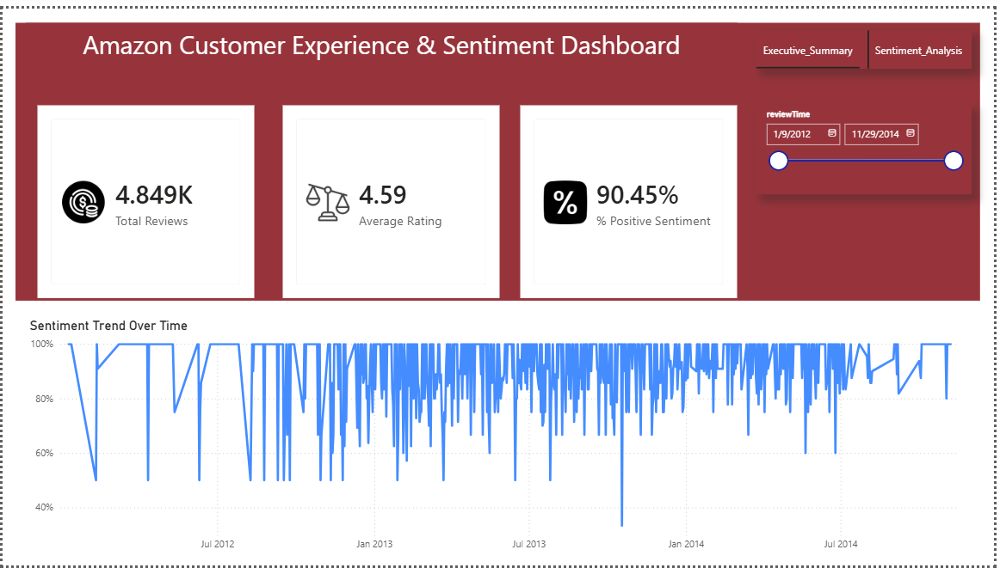
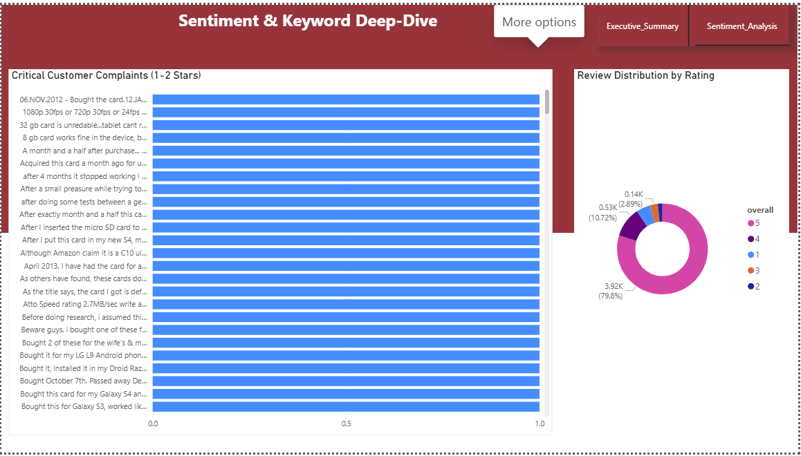

# Amazon Customer Experience & Sentiment Analysis Report (2025)

## Executive Summary

This project analyzes Amazon customer reviews and ratings to evaluate customer satisfaction levels and identify recurring feedback patterns. An interactive Power BI dashboard was developed to provide stakeholders with insights into customer sentiment, rating distributions, and review trends. The analysis reveals strong customer satisfaction levels and highlights opportunities for continuous improvement through customer feedback analysis.

---

## Business Context

Customer reviews significantly influence purchasing decisions and brand reputation in the e-commerce industry. Businesses must continuously monitor customer feedback to understand customer needs, identify recurring issues, and improve product quality.

This analysis was conducted to provide stakeholders with a clear understanding of customer sentiment and support data-driven decision-making.

---

## Objectives

1. Evaluate overall customer satisfaction levels.
2. Analyze customer sentiment trends over time.
3. Understand customer rating distribution.
4. Identify patterns within negative reviews.
5. Generate recommendations for improving customer experience.

---

## Data Overview

**Dataset:** Amazon Customer Reviews Dataset


**Source:** Kaggle

### Data Fields
- Customer Ratings (1–5 Stars)
- Review Date
- Review Text
- Product Feedback Records

The dataset contains customer-generated reviews used to measure customer satisfaction and sentiment performance.

---

## Key Findings

- Customer satisfaction levels are generally high.
- Positive reviews significantly outnumber negative reviews.
- Most customers provide ratings of 4 or 5 stars.
- Negative reviews reveal actionable improvement opportunities.
- Customer sentiment trends can help identify periods of declining satisfaction.

---

## Data Cleaning and Transformation

The following steps were completed before analysis:

- Removed duplicate records
- Checked and handled missing values
- Standardized column formats
- Converted date fields into proper date formats
- Validated data types
- Created sentiment classifications
- Developed DAX measures for KPI calculations
- Structured the data model for reporting

---

## Detailed Findings & Analysis
## Dashboard


### 1. Customer Satisfaction Overview

KPIs were created to monitor:

- Total Reviews
- Average Rating
- Positive Sentiment Percentage

These metrics provide an overview of customer satisfaction and overall brand perception.



### 2. Sentiment Trend Analysis

Time-series analysis was performed to monitor customer sentiment changes over time.

**Insight:** Trend analysis helps stakeholders identify periods of increased or decreased customer satisfaction.

### 3. Rating Distribution Analysis

Customer ratings were analyzed to understand review patterns.

**Insight:** Higher ratings dominate the dataset, indicating positive customer experiences.

### 4. Negative Review Investigation

Low-rated reviews were isolated and analyzed.

**Insight:** Negative reviews highlight recurring issues that may affect customer satisfaction and product performance.

---

## Recommendations

1. Continue monitoring customer sentiment through dashboard reporting.
2. Investigate recurring complaints found in low-rated reviews.
3. Improve customer feedback response processes.
4. Monitor sentiment trends regularly.
5. Use customer insights to guide product improvement initiatives.

---

## Tools Used

- Power BI Desktop
- Power Query
- DAX (Data Analysis Expressions)
- Microsoft PowerPoint
- GitHub

---

## Conclusion

The Amazon Customer Experience & Sentiment Dashboard successfully transformed raw customer review data into actionable business insights. Through interactive reporting and sentiment analysis, stakeholders can better understand customer behavior, monitor satisfaction trends, and make informed decisions to improve customer experience and product quality.
```
